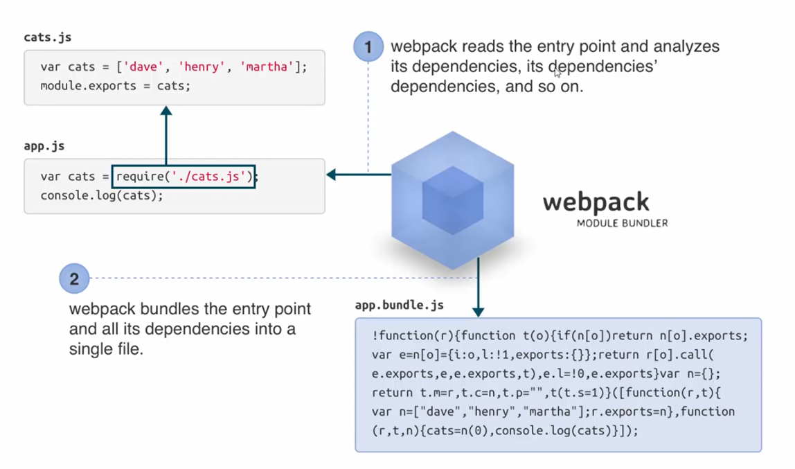

# Node.js crash course

[Video here](https://youtu.be/lziuNMk_8eQ)
[Actually here](https://youtu.be/CZnmKWgmL7s)

## What is it

Basically gets dynamic files into static ones

- Module bundler
- Takes custom files or NPM installed
- Fully dynamic files to static assets
- Extend with Plugins and Loaders

## Properties of a moduls

- Discrete chunk of functionality. Delegate some functionality to other modules.
- Abstraction
- Encapsulation
- Usually a single task or responsibility
- Reusable

## How is Webpack Different? (Other modules like browserfy)

- Code Splitting. Aloows to break up code into chunks. Loaded on demand. Provide split points
- Loaders (CSS, SASS, JSX, etc), get them right into javascript
- Clever parsing
- Plugins

## Example loaders

- CSS and Style
- SASS & Less
- JSX (React)
- Babel. To use ES6 Js sintax
- COffe
- Typescript
- EJS, Pug (jade), Handlebars
- JSON

## Webpack intallation

``` npm install -g webpack ```
To use the dev server. Serve in the browser
``` npm install webpack-dev-server ```

## How it works

